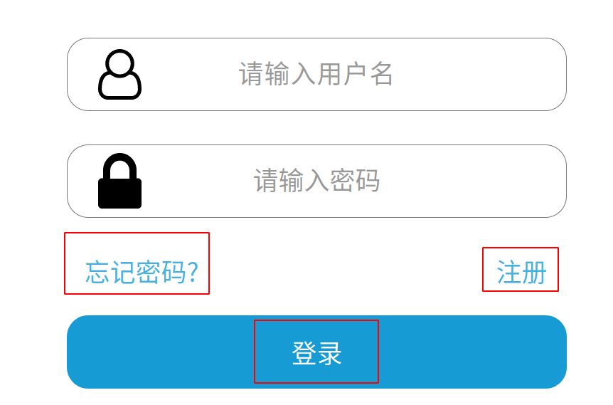
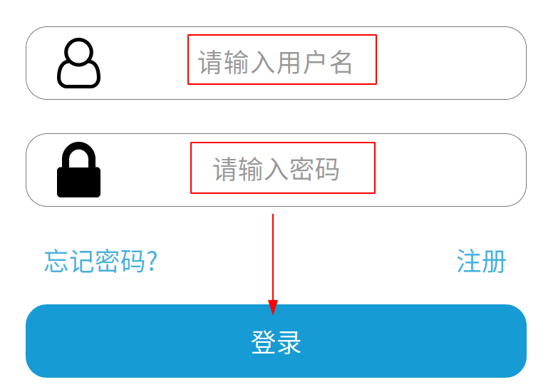
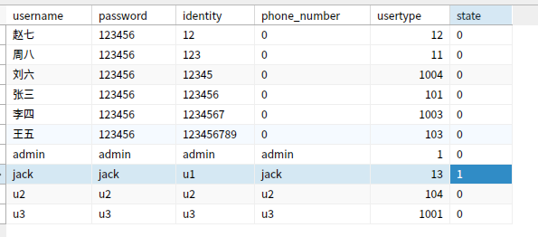

# medical
## 使用说明

### 0. 初始路径修改
修改路径为当前项目所在路径即可，如 `/opt/gopath/src/github.com/hyperledger/fabric-samples/medical/`
> 修改文件 -20230212 版
> - `main.go` : `SetPath = "/opt/gopath/src/github.com/hyperledger/fabric-samples/medical/"`
> - `config.yaml` : 对应行号 12,38,40,156,185,204
> - `config_monk.yaml` : 未涉及访问控制不用修改,对应行号 12,38,40,156,185,204

### 1.添加依赖：
```
cd medical && go mod tidy
```
### 2.运行项目：
```
第一步：chmod +x clean_docker.sh；或者进入该文件夹的父目录输入chmod +x medical -R，再重新进入medical文件夹
第二步：./clean_docker.sh
```
### 3.在`localhost:8088`登录系统

- 注意端口占用 - -
查询占用8088端口的进程PID，并kill掉
```
lsof -i:8088 
kill -9 xxx
```

### 4.在`localhost:8080`查看区块信息
区块链浏览器启动后在`localhost:8080`进行访问

- 提供手动关闭docker方式【可忽略】
- - 进入存有 `docker-compose.yaml` 文件的目录下输入 : `docker-compose down -v` 即可关闭

### 使用说明 -- End

## 修改说明

### 1.前端界面跳转
#### 1.1 初始界面:
存在三处跳转,以登录为例说明

**登录: 从 login 跳转到 index**
+ 新建html，命名：index.html，将Jack-Web-Design中对应网页源码复制过来，修改对应src路径
+ 修改login源码，设置登录为按钮button，样式为源码对应样式
```html
<!-- 登录 按钮 对应表单数据 -->
        <div id="u7" class="ax_default primary_button">
          <button type="submit" class="u7_div" style="color:white">登录</button>
          <!-- u7_div 复制过来作为样式声明 -->
          <style type="text/css">
            .u7_div {
              border-width:0px;
              position:absolute;
              left:0px;
              top:0px;
              width:703px;
              height:103px;
              background:inherit;
              background-color:rgba(22, 155, 213, 1);
              border:none;
              border-radius:30px;
              -moz-box-shadow:none;
              -webkit-box-shadow:none;
              box-shadow:none;
              font-family:'方正楷体简体';
              font-weight:400;
              font-style:normal;
              font-size:36px;
            }
          </style>
        </div>
```
+ 设置表单对应操作 `/login` ，确定对应操作范围
```html
<form id="fm1" action="/login" method="post" autocomplete="off">
......
</form>
```
+ 完成登录前端修改,开始go后端代码更改
+ 修改 `web/tpl/webServer.go`，添加操作捕获与对应页面跳转
```go
http.HandleFunc("/login", app.Login)
```
+ 修改 `web/controller/controllerHandler.go`，指定跳转网页 index.html,再重新编译medical二进制文件即可
```go
// 用户登录
func (app *Application) Login(w http.ResponseWriter, r *http.Request) {
	......
	ShowView(w, r, "index.html", data)
}
```
- **注意**，index必须先新建，原因windows和linux在回车上有区别，
原始网页源码为windows下编写，在linux无法解析对应回车符，需复制后再重新粘贴到对应html文件中

- **即 不能仅更改文件名,需新建文件再粘贴源码**
### 2.前后端数据交互
在登录时有两个数据用于获取，用户名和密码

+ 前端页面设置对应字段, `name="loginName",name="password"`
```html
<input id="u5_input" type="text" value="" name="loginName" class="u5_input" title="请输入账号" />
<input id="u6_input" type="password" value="" name="password" class="u6_input" title="请输入密码" />
```
+ 通过button对应的 `type="submit"` 进行数据提交,此时数据在同一表单范围内 `<form> ... </form>`
```html
<button type="submit" class="u7_div" style="color:white">登录</button>
```
+ 前端界面修改完成，开始后端go代码更改
+ 修改 `web/controller/controllerHandler.go`,保证字段一致即可 `"loginName"`,`"password"`
```go
func (app *Application) Login(w http.ResponseWriter, r *http.Request) {
	loginName := r.FormValue("loginName")
	password := r.FormValue("password")
}
```
+ 通过声明变量即可获取对应值，完成前端向后端数据传输
### 3.后端数据管理
完成登录修改数据库


+ 后端修改 `web/controller/controllerHandler.go` ,通过调用函数`UserLogin`将前端值`loginName, password`传入并处理
```go
	loginName := r.FormValue("loginName")
	password := r.FormValue("password")
	result, _ := app.Setup.UserLogin(loginName, password)
```
+ 修改 `service/medService.go`,添加函数声明：`UserLogin(username string, password string)`,返回结果 `(bool, error)`
```go
func (t *ServiceSetup) UserLogin(username string, password string) (bool, error) {
	
}
```
+ 调用数据库，进行数据字段的查找，验证用户名和密码
```go
    DB := InitDB()
    // 获取当前数据库中的用户名
	SQLString := "select username from login"
	Username := make(map[int]string)
	Username = queryDB(DB, SQLString)
    // 判断当前用户是否在数据库中
	for _, user := range Username {
        if user == username {
            var str string
			// 判断对应密码是否在数据库中
            SQLString2 := "select password from login where username='" + user + "'"
            err := DB.QueryRow(SQLString2).Scan(&str)
            if err != sql.ErrNoRows && str == password {
				// 用户名与密码存在，更新对应状态
                SQLString3 := "UPDATE login SET state= '1' where username='" + user + "'"
                _, err := DB.Exec(SQLString3)
                if err != nil {
                    return false, err
                }
                return true, nil
            }
        }
    }
    return false, nil
```
+ 完成登录验证和数据库更新
### 修改说明 -- End

## 虚拟机环境

### 虚拟机1-Ubuntu20.04
> 说明：
> - Go：`1.18.8`
> - 路径：/usr/local/software/go/ 
> - 其他开发路径：查看  `/etc/profile`
> - Docker：已配置国内源
> - Fabric：`2.2` 二进制文件 
> - 路径：/opt/gopath/src/github.com/hyperledger/fabric-samples/fabric/fabric-samples/bin
> - 项目地址：/opt/gopath/src/github.com/hyperledger/fabric-samples/medical

#### 获取链接

夸克网盘链接：[https://pan.quark.cn/s/4f4afd35cd55](https://pan.quark.cn/s/4f4afd35cd55)

提取码：XDLM

登录名/root :  `jack`

#### 开发工具使用：

单独开 **两个终端**：

`Navicat`:  `localhost:3306 root:root`

```shell
cd /home/jack/Software
./ForNavicat的激活与无限试用.sh
```

`GoLand`: 2021.3 Pro
```shell
cd /opt/GoLand-2021.3.3/bin/
./goland.sh
```
#### 虚拟机1-Ubuntu20.04 -- END
## 虚拟机2-Ubuntu22.04

网盘链接：[https://www.123pan.com/s/q9USVv-5k3l](https://www.123pan.com/s/q9USVv-5k3l)

提取码：tPRp

登录名 `ExcitedFrog`，密码与root：`19660813`

> 说明：
>
> - 区块链版本为Fabric 2.2.0，搭建步骤见[https://blog.csdn.net/weixin_44165950/article/details/124857431](https://blog.csdn.net/weixin_44165950/article/details/124857431)
> - golang版本为1.18.8
> - 含有vscode、vim和notepad++开发环境
> - 已更换为北大镜像源，换源步骤和内容（版本选22.04）见[https://mirrors.pku.edu.cn/Help/Ubuntu](https://mirrors.pku.edu.cn/Help/Ubuntu)
> - MySQL版本为8.0，用户和密码都为root，端口为3306
> - Navicat在主目录下的navicat文件夹内
> - docker使用的是docker.io，未换源
> 
### 虚拟机2-Ubuntu22.04 -- END